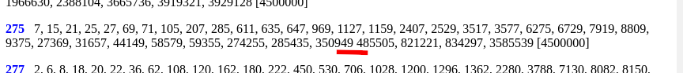

## Motivation

This is followup to creating all Proth primes k*2^m+1 with k<2^8 and m<2^15 in this forum posting:  
https://www.mersenneforum.org/showthread.php?p=653759#post653759

The k with maximal number of primes was k=165.  
I did search the first terms on oeis.org and found the corresponding sequence:  
https://oeis.org/A032459

And that pointed to "List of primes  k · 2” + 1  for  k < 300":  
http://www.prothsearch.com/riesel1.html

That page linked to pages for 300<k<600, 600<k<900 and 900<k<1200:  
http://www.prothsearch.com/riesel1a.html  
http://www.prothsearch.com/riesel1b.html  
http://www.prothsearch.com/riesel1c.html

These pages are HTML pages for human reading. Downloading with curl or wget results in big problems to parse as XML after preprocessing. So I stored the pages with chromium-browser "Save as…", as that saved the closing tags for each k line. After some preprocessing the .html files they are XML files and get transformed with a XSLT stylesheet. Final result is oneliner [Proth.json](Proth.json).

Create Proth.json:   
```
$ make 
$ make clean
$ 
```

JSON file can be used from any programming language. Here simple PARI/GP access demo:  
```
$ gp -q
? P=readvec("Proth.json")[1];
? #P
1200
? P[1]
[1, 2, 4, 8, 16]
? P[1199]
[1, 9, 11, 25, 27, 35, 57, 83, 161, 443, 457, 553, 1675, 2289, 2755, 3521, 6547, 6697, 7379, 8153, 11819, 12433, 12521, 13103, 44201, 46627, 47607, 63987, 132313, 471687, 901689, 1088471, 1150327, 1548171, 1874495, 2244631]
?
```


All odd 0<k<1200 have complete exponenents of Proth primes for at least up to 3,600,000:  
(odd indices are used for Proth prime exponent arrays, even indices store their Lim)   
```
? vecmin([P[2*i]|i<-[1..600]])
3600000
?
```


Sorting odd k #P[k] shows maximal number of Proth primes (=108) for k=165:  
```
? vecsort([[#P[2*i-1],2*i-1]|i<-[1..600]])[595..600]
[[92, 345], [92, 855], [95, 435], [96, 261], [102, 555], [108, 165]]
? 
```

In total there are 22,413 Proth primes k\*2^m+1 with odd k<1200 and m≥3,600,000:  
```
? vecsum([#P[2*i-1]|i<-[1..600]])
22413
? 
```

Alternative use of Proth.json via raw github URL, with curl installed:
```
$ gp -q
? P=extern("curl -s 'https://raw.githubusercontent.com/Hermann-SW/Proth/main/Proth.json'");
? vecsum([#P[2*i-1]|i<-[1..600]])
22413
? 
```

Proth.json is not big:  
```
$ du --bytes Proth.json 
146582	Proth.json
$ 
```


Validation failed:  
```
? forstep(k=1,1200,2,for(i=2,#P[k],if(P[k][i]<=P[k][i-1],print(k," ",i))));
275 34
? #P[275]
36
? 
```

Reason is that there was a missing comma on 1st HTML page:  


Fixed now:
```
? P=readvec("Proth.json")[1];
? forstep(k=1,1200,2,for(i=2,#P[k],if(P[k][i]<=P[k][i-1],print(k," ",i))));
? 
```

Biggest Proth prime in Proth.json does have nearly 5million decimal digits:  
```
? vecsort([[P[2*i-1][#P[2*i-1]],2*i-1]|i<-[1..600]])[600]
%7 = [16408818, 3]
? #digits(3*2^16408818+1)
%8 = 4939547
? 
```
